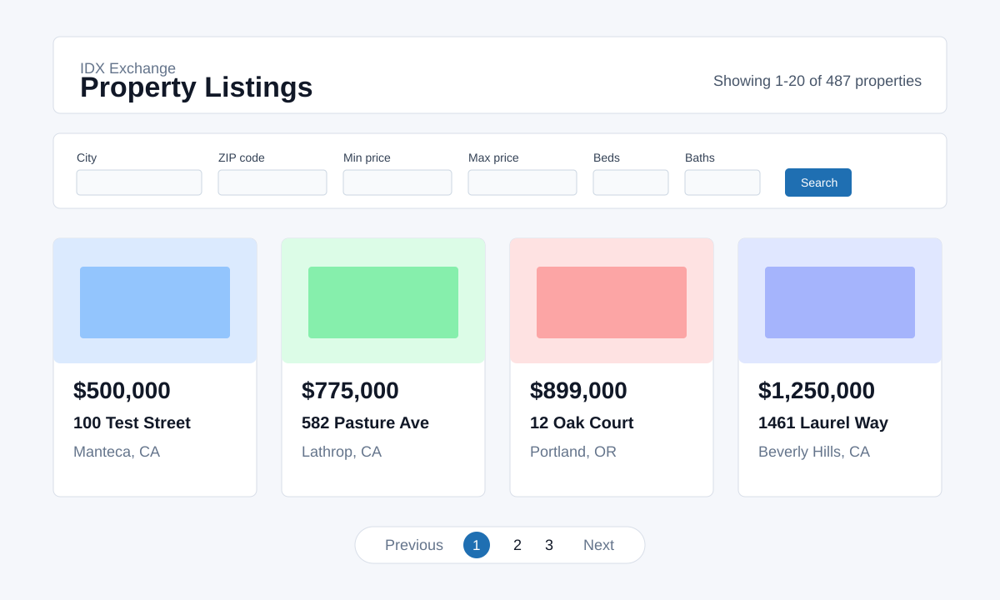

# IDX Property Search Platform

A full-stack real estate listing application with a Node.js/Express API, MySQL
database, and React frontend. Users can search, filter, sort, paginate, favorite,
and inspect property listings with photos, maps, and open house details.



## Tech Stack

- Node.js 22+
- Express 5
- MySQL 8 running in Docker
- mysql2 promise connection pool
- React 18 with Create React App
- React Router 6
- Jest-style React tests through `react-scripts test`
- Jest + Supertest for backend route tests
- oxlint for frontend linting

## Project Structure

```text
backend/
  db.js                         MySQL connection pool
  server.js                     Express app setup, middleware, health endpoint
  routes/properties.js          Property search, detail, and open house routes
  sql/                          Index scripts and EXPLAIN documentation
  test/                         Backend route and query tests
frontend/
  src/api/client.js             API request helpers
  src/components/               Reusable UI components
  src/hooks/useFavorites.js     Favorites custom hook backed by localStorage
  src/pages/                    Route-level screens
  src/utils/                    Formatting, photo parsing, open house helpers
```

## Local Setup

1. Install Docker Desktop and start it.
2. Start the MySQL container:

```bash
docker run --name idx-mysql-local \
  -e MYSQL_ROOT_PASSWORD=password \
  -e MYSQL_DATABASE=rets \
  -p 3306:3306 \
  -d mysql:8
```

3. Import the RETS SQL files into the `rets` database:

```bash
docker exec -i idx-mysql-local mysql -uroot -ppassword rets < rets_property.sql
docker exec -i idx-mysql-local mysql -uroot -ppassword rets < rets_openhouse.sql
```

4. Create `backend/.env`:

```env
DB_HOST=127.0.0.1
DB_PORT=3306
DB_USER=root
DB_PASSWORD=password
DB_NAME=rets
PORT=5000
```

5. Install and run the backend:

```bash
cd backend
npm install
npm run dev
```

6. In a second terminal, install and run the frontend:

```bash
cd frontend
npm install
npm start
```

7. Open `http://localhost:3000`.

## API Reference

### `GET /api/health`

Checks whether the backend can query MySQL.

Example response:

```json
{
  "status": "ok",
  "database": "connected"
}
```

### `GET /api/properties`

Returns paginated property results.

Supported query parameters:

- `city`
- `zipcode`
- `minPrice`
- `maxPrice`
- `beds`
- `baths`
- `limit`
- `offset`
- `sortBy`: `price`, `dateListed`, `sqft`, or `beds`
- `sortOrder`: `asc` or `desc`

Example request:

```text
GET /api/properties?city=Beverly%20Hills&minPrice=300000&beds=3&limit=5&offset=0
```

Example response:

```json
{
  "total": 87,
  "limit": 5,
  "offset": 0,
  "results": []
}
```

Invalid request example:

```text
GET /api/properties?sortBy=badField
```

Example error:

```json
{
  "error": "sortBy must be one of: price, dateListed, sqft, beds"
}
```

### `GET /api/properties/:id`

Returns a single property by `L_ListingID`.

Example request:

```text
GET /api/properties/1001
```

Example 404 response:

```json
{
  "error": "Property 1001 was not found"
}
```

### `GET /api/properties/:id/openhouses`

Returns open house events for a property. An empty array is a valid response when
the property exists but has no open houses.

Example response:

```json
[
  {
    "L_ListingID": "1001",
    "OpenHouseDate": "2026-09-05",
    "OH_StartTime": "13:00:00"
  }
]
```

## Database Schema Summary

Main tables:

- `rets_property`: property listing records
- `rets_openhouse`: open house records linked to listings by `L_ListingID`

Important `rets_property` columns:

- `L_ListingID`: unique listing identifier used by detail and open house routes
- `L_Address`, `L_City`, `L_State`, `L_Zip`: address fields
- `L_SystemPrice`: list price
- `L_Keyword2`: beds
- `LM_Dec_3`: baths
- `LM_Int2_3`: square feet
- `ListingContractDate`: listed date used for date sorting
- `L_Photos`: JSON array stored as a string
- `LMD_MP_Latitude`, `LMD_MP_Longitude`: map location

Important `rets_openhouse` columns:

- `L_ListingID`: property relationship
- `OpenHouseDate`: open house date
- `OH_StartTime`, `OH_EndTime`: open house time range
- `all_data`: JSON string containing additional MLS fields such as remarks

## Performance

The property search endpoint uses parameterized queries and validates all numeric,
string, and sorting inputs before building SQL. Common filter and sort patterns
are supported by indexes documented in:

- `backend/sql/week3_property_indexes.sql`
- `backend/sql/week4_detail_openhouse_indexes.sql`
- `backend/sql/week9_performance_indexes.sql`
- `backend/sql/week9_explain_notes.md`

`EXPLAIN` is used to confirm MySQL chooses an index. The important column to
check is `key`: when it is not `NULL`, MySQL is using an index for that query.

## Testing

Run backend tests:

```bash
cd backend
npm test
```

Run backend coverage:

```bash
cd backend
npm run test:coverage
```

Run frontend tests:

```bash
cd frontend
npm test
```

Run frontend coverage:

```bash
cd frontend
npm run test:coverage
```

Run frontend lint:

```bash
cd frontend
npm run lint
```

## Known Issues And Future Improvements

- Some MLS photo URLs can expire or reject browser requests, so the UI displays
  a graceful fallback when an image cannot load.
- The Google Maps iframe requires a local `.env` API key and will not work if the
  key is missing or restricted incorrectly.
- The backend test suite uses mocked database pools so it can run without a local
  MySQL container.
- Future improvements could include server-side favorites, authentication,
  saved searches, and deployment-specific environment configuration.
